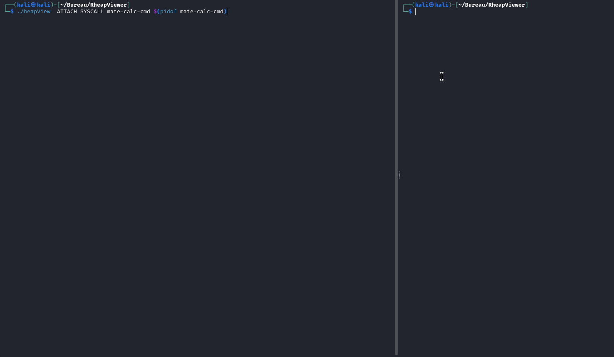

# HeapViewer

HeapViewer is small tool to visualize the heap state of a program using ptrace. 

The goal is to print all the heap chunks until my estimated top chunk is met.

You can either:
- attach to an existing process 
- launch a process 

HeapViewer allows you to print the heap state at :
- each instruction of the program (.text section)
- each SYSCALL 


> [!WARNING]  
> Printing the heap state at each instruction is VERY SLOW due to the usage of PTRACE_SINGLESTEP. Do not use on medium/large binary ! 


## Installation

```bash
make
```

## Usage

```bash
usage: ./heapView MODE TYPE BINARY_NAME 

MODE: NORMAL | ATTACH 
TYPE: SINGLE | SYSCALL


NORMAL:  [SINGLE|SYSCALL] BINARY_NAME

        ex: ./heapView NORMAL SSTEP PATH_TO_BINARY_NAME

        ex: ./heapView NORMAL SYSCALL PATH_TO_BINARY_NAME

ATTACH:  [SINGLE|SYSCALL] BINARY_NAME PID

        ex: ./heapView ATTACH SSTEP PATH_TO_BINARY_NAME PID

        ex: ./heapView ATTACH SYSCALL PATH_TO_BINARY_NAME PID


SSTEP (for single step) : print heap at each instruction inside .text of the binary
SYSCALL: print heap whenever a SYSCALL happen
```

> [!NOTE]  
> In some cases due to kernel hardening , PTRACE_ATTACH may required sudo privileges 


## DEMO

Launch a process and print the heap state at each instruction.

```bash
./heapView NORMAL SSTEP test/poc
```


Launch a process and print the heap state at each SYSCALL.

```bash
./heapView NORMAL SYSCALL test/poc
```


ATTACH to an existing program and print the heap state at each SYSCALL

```bash
./heapView ATTACH SYSCALL mate-calc-cmd $(pidof mate-calc-cmd)
```


